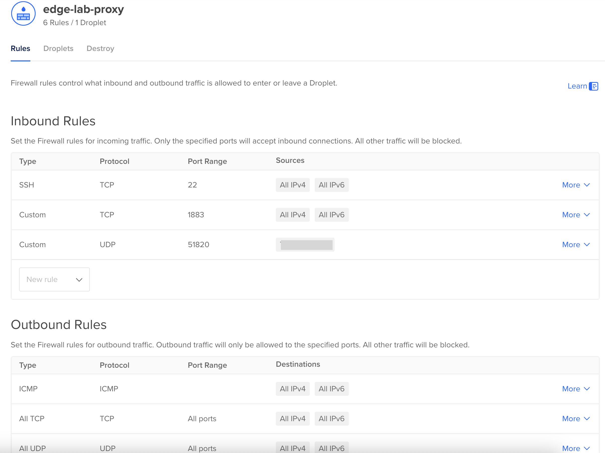

# MQTT Internet Gateway

To get internet MQTT traffic routed to our cluster there are several different approaches we can take. We could setup port forwarding on our home router for MQTT traffic (port 1883) and use dynamic DNS to keep a domain name pointed to our current public IP address from our home internet provider. But this raises both security concerns (exposing home internet ports to public traffic) as well as maintenance concerns (maintaining our dynamic DNS entry in case our public IP address changes).

Instead, we'll setup a virtual machine in the cloud as the Gatway to our edge lab cluster. Then we'll connect our cloud gateway vm to pi0 through a VPN powered by wireguard. While this approach will cost us a few dollars/month, and limit our outbound traffic 

## Setup a Cloud VM

By running a virtual machine in the cloud, you'll be able to have a public IP address that can accept internet MQTT traffic and route it to your edge lab cluster. There are many options for running a virtual machine in the cloud, but I'm partial to DigitalOcean since I had an amazing experience when I worked there in the past. Any of their [Droplet](https://www.digitalocean.com/pricing/droplets) (VM) offerings would work; I've chosen the 1 GiB, 1 vCPU Regular Basic droplet which includes 1 TiB of (outbound) network bandwidth. DigitalOcean's [Production-Ready Droplet guide](https://docs.digitalocean.com/products/droplets/getting-started/recommended-droplet-setup/) gives a very good walkthrough for setting up a virtual machine you plan to leave in publicly exposed to the internet. Here are some additional notes on the steps I took:

- I chose NYC3 as my data center, though any one should work for our purposes
- I chose Ubuntu 22.04 as my image because it is the most recent long-term support (LTS) release
- I chose the Basic, Regular, $6/month Droplet
- I enabled IPv6 as per the guide, but did not add improved metrics monitoring (because I plan to install Netdata)
- For everything else, I followed the guide, including the creation of a free cloud firewall, like this:
  
  - I left Outbound Rules unchanged from the default, which allows all outbound traffic
  - I added two Inbound Rules to 1) allow for MQTT traffic (TCP port 1883) from the any internet client and 2) allow for a WireGuard connection (UDP port 51820) from my edge-lab which we'll setup shortly. For added security, since my home internet IP address rarely changes, I've restricted the source for WireGuard traffic to only be my home public IP address (which I found with a [Google search](https://www.google.com/search?q=what%27s+my+ip+address)).
- After starting the Droplet, I also created a [Reserved IP](https://docs.digitalocean.com/products/networking/reserved-ips/), which costs nothing if it remains attached to a Droplet and which gives you the ability to migrate from one Droplet to another (e.g. for failover or resizing) without having to change your public IP address.

Setting up WireGuard
