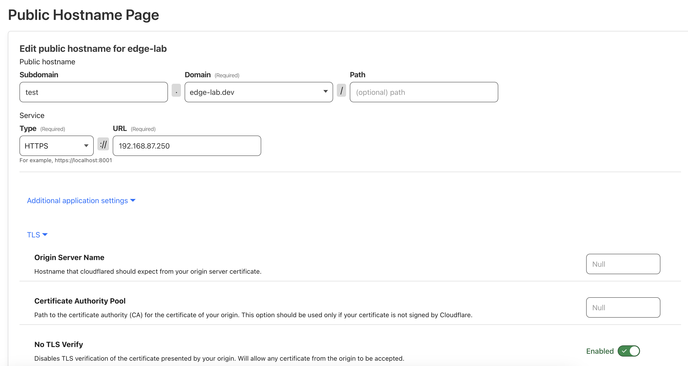

## Kubernetes

[Kubernetes 101: Deploy Your First Application with MicroK8s - The New Stack](https://thenewstack.io/kubernetes-101-deploy-your-first-application-with-microk8s/)

[Tools To Make Your Terminal DevOps and Kubernetes Friendly](https://www.linkedin.com/pulse/tools-make-your-terminal-devops-kubernetes-friendly-maryam-tavakkoli/)


### Install MicroK8s on all Nodes

First, follow the [Raspberry Pi specific instructions](https://microk8s.io/docs/install-raspberry-pi) in the MicroK8s installation docs:

```bash
sudo nano /boot/firmware/cmdline.txt
```

And adding the following to the end of the command line:

```bash
cgroup_enable=memory cgroup_memory=1
```

For Raspberry Pi OS, there was no need to follow the Ubuntu-specific instruction to install `linux-modules-extra-raspi`.


From here, you can proceed with the main [Getting Started](https://microk8s.io/docs/getting-started) instructions in the MicroK8s documentaion.

```bash
snap install microk8s --classic
sudo usermod -a -G microk8s $USER
sudo mkdir -p ~/.kube
sudo chown -f -R $USER ~/.kube

# You will also need to re-enter the session for the group update to take place:

su - $USER
```

Specify an explicit channel in the snap install above (e.g. `--channel=1.29`) if you want a specific version of K8s such as the latest.

Wait for K8s to become available.

```bash
microk8s status --wait-ready
```

Check that it's working:

```bash
microk8s kubectl get nodes
```

Repeat the above on the other Raspberry Pis.


### Enable the MicroK8s Storage add-on

On one of the cluster nodes, run the following:

```bash
# Need to create a storage class
microk8s enable hostpath-storage
```

This will ensure that simple persistent volumes can be created using the disks that are attached to each node of the cluster. Our MQTT broker (VerneMQ) should not need any form of shared storage between the nodes since it handles all of its own [inter-node communication](https://docs.vernemq.com/vernemq-clustering/communication). We should, however, switch from hostpath-storage to [Local Persistent Volumes](https://kubernetes.io/blog/2019/04/04/kubernetes-1.14-local-persistent-volumes-ga/). Per the K8s documentation:

> With HostPath volumes, a pod referencing a HostPath volume may be moved by the scheduler to a different node resulting in data loss. But with Local Persistent Volumes, the Kubernetes scheduler ensures that a pod using a Local Persistent Volume is always scheduled to the same node.


There's also an [Ansible](Ansible.md) script in this repository for installing MicroK8s that automates the above two sections.


### Join all Nodes to a Single Cluster

At this point, each Node is independently running a separate K8s instance. For redundancy we want to create a cluster of nodes in K8s. MicroK8s makes this simple. We'll follow the instructions in the [clustering documentation](https://microk8s.io/docs/clustering).

On pi1, run the following:

```bash
microk8s add-node
```

This will return some joining instructions which should be executed **on the MicroK8s instance that you wish to join to the cluster (NOT THE NODE YOU RAN `add-node` FROM)**, similar to this:

```bash
From the node you wish to join to this cluster, run the following:
microk8s join 192.168.1.230:25000/92b2db237428470dc4fcfc4ebbd9dc81/2c0cb3284b05
```

Follow these instructions on the other nodes in the cluster. Once you've done this successfully, you should be able to run this command from any of the cluster machines:

```bash
microk8s kubectl get nodes
```

And you should see output like the following:

```bash
NAME   STATUS   ROLES    AGE   VERSION
pi2    Ready    <none>   25h   v1.28.7
pi3    Ready    <none>   25h   v1.28.7
pi1    Ready    <none>   29h   v1.28.7
```


There's also an [Ansible](Ansible.md) script in this repository that will join together the nodes for you by running the above commands.


### Setup client access to the K8s cluster

#### MacOS Routing

```bash
brew install kubectl
```

If the cluster is on a different subnet than your client, ensure proper routing from your laptop. On a Mac, you can run the following command (first IP is the cluster subnet, second IP is the address of the router that connects the subnets.. in our case the home network IP address of pi0):

```bash
sudo route -n add -net 192.168.87.0/24 192.168.86.X >/dev/null 2>&1
```

This will establish the route temporarily (until reboot). To establish it permanently, a lightweight approach is to add the above to your ~/.zshrc file

```bash
nano ~/.zshrc
# Add this line to the bottom:
sudo route -n add -net 192.168.87.0/24 192.168.86.200 >/dev/null 2>&1
```

If you don't want to be prompted for a sudo password every time you start a new shell, do this:

```bash
sudo visudo
# At the end of the file, add:
YOUR_USERNAME ALL=(ALL) NOPASSWD: /sbin/route -n add -net 192.168.87.0/24 192.168.86.200
# Where YOUR_USERNAME is your Mac username and the command needs to match up with the above
```

Close and reopen your terminal, or `source ~/.zshrc` and you should now be able to ping machines on the cluster subnet (192.168.87.0/24 in the above example).

Note that with this approach, if you reboot your machine and try to use your browser (or any other tool) to access the cluster subnet before opening a terminal it won't work because the route won't be set yet.

#### Routing for Other Client Operating Systems

For more help, ask the [Edge Lab Assistant](https://chat.openai.com/g/g-CCcHNwSF9-edge-lab-assistant) about your specific situation. For example: `I'm running an Ubuntu Linux laptop and need a route from my laptop to a different subnet. The subnet is 192.168.87.0/24 and my laptop can access it via the gateway at 192.168.86.200. I also need to make the route permanent.`


#### Downloading kube config

Get the kubeconfig from the cluster by running the following on any cluster machine:

```bash
microk8s kubectl config view --minify --flatten  > ~/kubeconfig.yaml
```

Transfer this file to the client and save it to your laptop's home directory in a file named `/.kube/config`. For example, you could use `scp` if your laptop is a Mac or Linux machine:

```bash
scp pi1.local:kubeconfig.yaml ~/.kube/config 
```

Edit the kubeconfig and update the `server` line so it points to one of the cluster machines.

```bash
nano ~/.kube/config
```

```yaml
- cluster:
    certificate-authority-data: ...
    server: https://192.168.87.101:16443
```

Replace the above with the IP address of your pi1.

Now you can run kubectl commands against the cluster. 

```bash
kubectl get nodes
```

To avoid security warnings about your kube config, you can change its permissions as follows:

```bash
chmod 600 ~/.kube/config
```


#### Install k9s

K9s is an excellent terminal application for visually managing all aspects of your Kubernetes cluster. Though not required, it is a recommended tool that's easy to [install](https://k9scli.io/topics/install/). It will work correctly as long as `kubectl` is setup and working.


# Getting Ingress Working

## MetalLB

This will be used simply to provide an external IP to the Kubernetes Ingress service

```bash
helm repo add metallb https://metallb.github.io/metallb
helm repo update
helm install metallb metallb/metallb --create-namespace \
--namespace metallb-system
```

Wait for all resources to be created.

`metallb-ip-pool.yaml`:

```yaml
---
apiVersion: metallb.io/v1beta1
kind: IPAddressPool
metadata:
  name: default-pool
  namespace: metallb-system
spec:
  addresses:
  - 192.168.87.250-192.168.87.255
```

```bash
kubectl apply -f metallb-ip-pool.yaml
```

`metallb-l2adv.yaml`:

```yaml
---
apiVersion: metallb.io/v1beta1
kind: L2Advertisement
metadata:
  name: default-l2
  namespace: metallb-system
spec:
  ipAddressPools:
  - default-pool
```

```bash
kubectl apply -f metallb-l2adv.yaml
```


## Voyager (HAProxy)

As recommended in the [VerneMQ documentation](https://docs.vernemq.com/guides/vernemq-on-kubernetes), we need an ingress controller that supports TCP load balancing based on source IP hash as well as TLS termination. We'll use [Voyager](https://github.com/voyagermesh/voyager), which wraps HAProxy and allows for a simple configuration of both of these. However, Voyager requires a license key and has unclear pricing and usage terms. Given this, we'll continue to explore other options such as [Envoy Gateway](<Envoy Gateway.md>) as they become more mature.

### Install Voyager

Following the [Voyager setup documentation](https://voyagermesh.com/docs/v2023.9.18/setup/install/voyager/) and first obtain a license file. Then, create the following `values.yaml` so that Voyager can obtain an external IP address through the metallb load balancer:

```yaml
controller:
  service:
    type: LoadBalancer
```


Install Voyager via Helm, applying the above values.yaml.

```bash
export provider=metallb
helm install voyager oci://ghcr.io/appscode-charts/voyager \
  --version v2023.9.18 \
  --namespace voyager --create-namespace \
  --set cloudProvider=$provider \
  --set-file license=/path/to/the/license.txt \
  --wait --burst-limit=10000 --debug \
  -f values.yaml
```

Replace `/path/to/the/license.txt` with the proper path to your license file. (Also, you can check ghcr.io/appscode-charts/voyager to see if there is a newer version).


## cert-manager

CertManager handles automatic provisioning of LetsEncrypt certificates, which are useful for a number of things inside your K8s cluster. We'll use them to enable https and mqtts connections. 

```bash
helm repo add jetstack https://charts.jetstack.io
helm repo update
helm install cert-manager jetstack/cert-manager \
  --set installCRDs=true \
  --namespace cert-manager  \
  --create-namespace
kubectl create secret generic cloudflare-api-token-secret --from-literal=api-token='YOUR_CLOUDFLARE_API_TOKEN' -n cert-manager
```

In the above, replace `YOUR_CLOUDFLARE_API_TOKEN` by retrieving your Cloudflare API token from the [Cloudflare Dashboard](https://dash.cloudflare.com/). This assumes you're using Cloudflare for your nameservers. If you're not, you'll need to setup a different solver by following [certmanager documentation](https://cert-manager.io/docs/configuration/acme/dns01/).

Setup a ClusterIssuer. `letsencrypt-clusterissuer.yaml`:

```yaml
---
apiVersion: cert-manager.io/v1
kind: ClusterIssuer
metadata:
  name: letsencrypt-issuer
spec:
  acme:
    # server: https://acme-staging-v02.api.letsencrypt.org/directory  # Staging URL
    server: https://acme-v02.api.letsencrypt.org/directory # Production URL
    email: youremail@example.com
    privateKeySecretRef:
      name: letsencrypt-private-key
    solvers:
    - dns01:
        cloudflare:
          email: youremail@example.com
          apiTokenSecretRef:
            name: cloudflare-api-token-secret
            key: api-token
```

```bash
kubectl apply -f letsencrypt-clusterissuer.yaml
```

In the above, you may want to start with the Staging URL until you've verified that you're able to successfully obtain valid certificates. This avoids any rate limiting you might experience through the Production letsencrypt URL. These staging certificates won't work when you try to access a secure (https) route in your K8s cluster, so once you've confirmed you can successfully obtain a cert you should switch to the Production URL and apply the YAML again.

HAProxy (Voyager) will automaticalyl request a certificate for you through this issuer when you setup your Ingress below.

### Test it out with a simple HelloWorld service

`hello-deployment.yaml`:

```yaml
apiVersion: apps/v1
kind: Deployment
metadata:
  name: hello-world
spec:
  replicas: 3
  selector:
    matchLabels:
      app: hello-world
  template:
    metadata:
      labels:
        app: hello-world
    spec:
      containers:
      - name: hello-world
        image: nginxdemos/hello
        ports:
        - containerPort: 80
```

```bash
kubectl apply -f hello-deployment.yaml
```

(At this point you can access the hello-world web app by first port forwarding from one of your pods and then hitting localhost. But port forwarding is temporary.)

`hello-service.yaml`:

```yaml
apiVersion: v1
kind: Service
metadata:
  name: hello-world-service
spec:
  type: ClusterIP
  selector:
    app: hello-world
  ports:
    - protocol: TCP
      port: 80
      targetPort: 80
```

```bash
kubectl apply -f hello-service.yaml
```

(At this point you can access the hello-world web app by first port forwarding from your Service and then hitting localhost. But port forwarding is temporary.)

Setup an Ingress for this service that uses the letsencrypt-issuer. 

`voyager-ingress.yaml`:

```yaml
---
apiVersion: voyager.appscode.com/v1
kind: Ingress
metadata:
  name: default-ingress
  namespace: default
  annotations:
    cert-manager.io/cluster-issuer: "letsencrypt-issuer"
spec:
  tls:
  - hosts:
      - test.example.com
    secretName: test-edge-lab-dev-tls
  rules:
  - host: test.example.com
    http:
      paths:
      - backend:
          service:
            name: hello-world-service
            port:
              number: 80
```

```bash
kubectl apply -f voyager-ingress.yaml
```

In the above, replace test.example.com with your domain. This will automatically create a new CertificateRequest, which should result in a new Certificate if everything was configured correctly. It may take a few minutes, but you should see a successful CertificateRequest, Certificate, and Secret all setup in your cluster.

To test, you'll likely need to setup your voyager-default-ingress external IP in your `/etc/hosts` file by adding a line that looks like this:

```
192.168.87.250  test.edge-lab.dev
```

Now you can use curl to retrieve the page:

```bash
curl https://test.example.com
```

This should return the html from the hello-world-service. You should also be able to access this from your browser.

But even after all this, your service won't be accessible from a machine that isn't on your edge-lab subnet (or explicitly routing to your subnet as configured above). To enable outside access, there are several options:

- Setup port 80 forwarding from your home router to your pi0 router and then on to your K8s voyager-default-ingress IP address. Finally, configure DNS for your hostname.
- **Recommended:** Establish a [cloudflare tunnel](https://developers.cloudflare.com/cloudflare-one/connections/connect-networks/). Follow the instructions in the documentation, and when connecting an application, the configuration should look similar to this, but using your own Cloudflare-managed domain:
  


### Netdata monitoring in K8s

On one of the nodes, run NetData following the instructions in the [Netdata documentation](https://learn.netdata.cloud/docs/netdata-agent/installation/docker). 

With the following, netdata will monitor each of your K8s nodes, including auto-discovery and monitoring of VerneMQ, even across namespaces:

```bash
helm repo add netdata https://netdata.github.io/helmchart/
helm install netdata netdata/netdata -n netdata --create-namespace
```

Follow the instructions after installation to identify the IP and port of your netdata dashboards. I found them at: `http://<pi-machine-IP>:19999`

Each node has its own dashboard but hopefully we can find a way to combine them.

### Curl / Troubleshoot

[How to run curl in Kubernetes (for troubleshooting) - Tutorial Works](https://www.tutorialworks.com/kubernetes-curl/)

```bash
kubectl run mycurlpod --image=curlimages/curl -i --tty -- sh
```

For a given Helm deployment, you can check the full helm-calculated manifest with the `--dry-run` and `--debug` flags. For example:

```bash
helm upgrade my-vernemq vernemq/vernemq -f values.yaml -n vernemq --dry-run --debug
```

This will give you a view into the merged configuration based on both the raw chart and your custom values.

