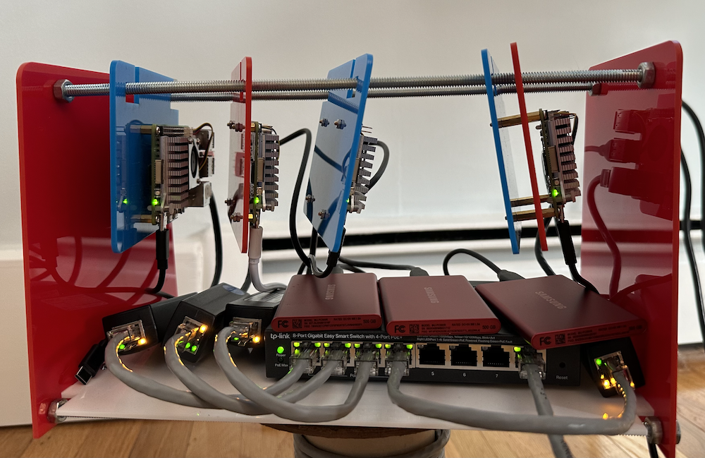

# Build a Laser Cut Rack

Rather than have a bunch of Raspberry Pis laying out on my desk, I thought it would make sense to build a rack to contain them all nicely together. This [rack from C4 Labs](https://www.amazon.com/Cloudlet-CASE-Raspberry-Computers-Compatible/dp/B0844YSJWB) is very nice and well rated. But since I'm lucky enough to have access to a Glowforge, I thought I'd make my own rack.

## Edge Lab Rack v1

It's a little messy, but it gets the job done and makes it easier to transport all the Pis and peripherals in one go.

### Parts

- Four (4) 1/4" X 12" threaded rods (I would have chosen metric for consistency, but couldn't find any at my local hardware store)

- Sixteen (16) 1/4"-20 steel nuts (to match up with the threaded rods)

- 3mm acrylic laser cut panels for sides and shelf (see [pattern](edge-lab-rack.svg))

- 3mm acrylic laser cut hanging panels for mounting the Pis (see [pattern](edge-lab-rack.svg))

- 

### Physical

- Rack dimensions are approximately 300mm X 165mm x 180mm (width X depth X height)

- Assembly is completely mechanical (no glueing), relying on the 4 rods and T-joints to keep everything in place. 

- This design has proven fairly sturdy, even able to stand up to torsion without loosening.
