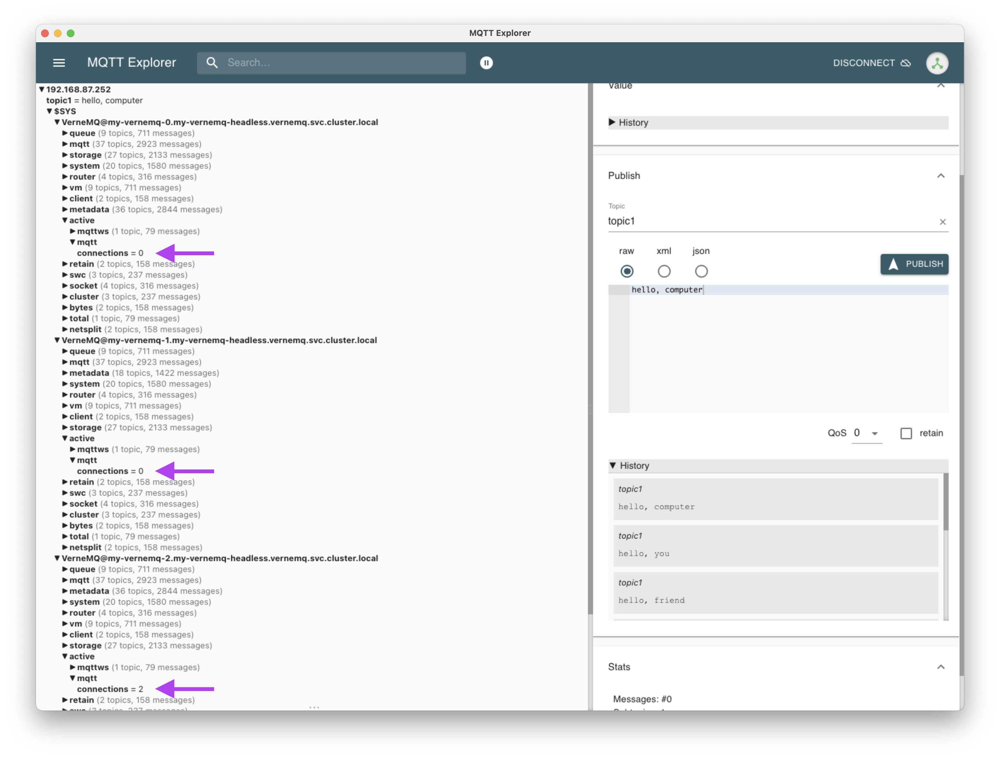

# Verne MQTT Broker

Fully open source, cluster-able MQTT broker. 

## Kubernetes VerneMQ Cluster Deployment

These are the best instructions on VerneMQ containerized cluster deployment:

[GitHub - vernemq/docker-vernemq: VerneMQ Docker image - Starts the VerneMQ MQTT broker and listens on 1883 and 8080 (for websockets).](https://github.com/vernemq/docker-vernemq)

Use helm

```bash
helm repo add vernemq https://vernemq.github.io/docker-vernemq
helm install my-vernemq vernemq/vernemq -f values.yaml -n vernemq --create-namespace
```


`values.yaml`:

```yaml
replicaCount: 3
podAntiAffinity: hard
additionalEnv:
  - name: DOCKER_VERNEMQ_ACCEPT_EULA
    value: "yes"
  - name: DOCKER_VERNEMQ_ALLOW_ANONYMOUS
    value: "on"

env:
  - name: DOCKER_VERNEMQ_DISCOVERY_KUBERNETES
    value: "1"
  - name: MY_POD_NAME
    valueFrom:
      fieldRef:
        fieldPath: metadata.name
  - name: DOCKER_VERNEMQ_KUBERNETES_LABEL_SELECTOR
    value: "app=vernemq,release=myinstance"
  - name: DOCKER_VERNEMQ_LOG__CONSOLE
    value: "console"
  - name: DOCKER_VERNEMQ_LOG__CONSOLE__LEVEL
    value: "debug"
```

Forward the `my-vernemq` Service port 1883 to localhost and you can now test pub/sub. In one terminal:

```bash
mosquitto_sub -h localhost -t topic1 -i my-client-id1
```

In another terminal:

```bash
mosquitto_pub -h localhost -t topic1 -m "ok,computer" -i my-client-id2
```

(For help installing the mosquitto-clients on Debian-based systems or MacOs, visit the [Edge Lab Assistant](https://chat.openai.com/share/cc37bad8-90d8-454e-8125-9a538d4ebae6). Or see the official [mosquitto download instructions](https://mosquitto.org/download/) for Windows binaries or other operating systems). 


### MQTT Ingress

Now let's get Ingress setup for VerneMQ so we can have a more permanent way to access our MQTT broker from outside the cluster. Assuming you've followed the steps in your [Kubernetes](Kubernetes.md) setup to get ingress configured, you should now be able to do the following:

```bash
nano verne-ingress.yaml
```

`verne-ingress.yaml`:

```yaml
apiVersion: voyager.appscode.com/v1
kind: Ingress
metadata:
  name: verne-ingress
  namespace: vernemq
  annotations:
    ingress.appscode.com/keep-source-ip: "true"

spec:
  rules:
  - host: mqtt.edge-lab.dev
    tcp:
      port: 1883
      backend:
        service:
          name: my-vernemq
          port:
            number: 1883
        loadBalanceOn: source
```

```bash
kubectl apply -f verne-ingress.yaml
```

Now you can run the same mosquitto commands above, but using the external IP address assigned to the `voyager-verne-ingress` service. For example:

```bash
mosquitto_sub -h 192.168.87.252 -t topic1 -i my-client-id1
```

and

```bash
mosquitto_pub -h 192.168.87.252 -t topic1 -m "hello,computer" -i my-client-id2
```

Also, with this configuration, MQTT connections from a given client should always route to the same pod in the cluster. This can be tricky to test, but if you run multiple clients from only one machine (e.g. [MQTT-Explorer](https://mqtt-explorer.com/) and the mosquitto_sub/pub command line), then you should be able to inspect the $SYS topic in MQTT Explorer and see under each cluster node active/mqtt/connections should be 0 for two of the nodes and equal to the number of connected clients for the third node, like this:


If you now connect another MQTT client from a different device with a different IP address, you should see the connection count increase on one of the nodes. It could be on one of the two nodes that previously had 0 connections, or it could be on the already-connected node if the hashing algorithm happens to hash the new device's IP to the same output as your first device. Just keep trying to connect more devices with different IP addresses, and eventually one should connect to a different node.


### Netdata monitoring of Verne

After installing Verne, Netdata should automatically start monitoring your MQTT broker cluster for you. If you access the Netdata Agent Console via http://<netdata-external-IP>:19999, you'll see on the right hand side of your Metrics a section called VerneMQ that includes stats such as mqtt connects, disconnects, subscribes, etc.


### Authentication

At any point, it's possible to live change whether anonymous authentication is allowed.

View and set [VerneMQ live config](https://docs.vernemq.com/live-administration/config_values) values with:

```bash
kubectl exec --namespace vernemq my-vernemq-1 -- /vernemq/bin/vmq-admin show allow_anonymous --all
kubectl exec --namespace vernemq my-vernemq-1 -- /vernemq/bin/vmq-admin set allow_anonymous=on --all
```

(`--all` shows/sets all cluster nodes)

We can test [file-based auth](https://docs.vernemq.com/configuring-vernemq/file-auth) like this (note that this needs to be done on each pod):

```bash
kubectl exec --namespace vernemq -it my-vernemq-0 -- /bin/bash
vmq-passwd -c ./etc/vmq.passwd <user>
# then interactively enter and confirm the password
nano ./etc/vmq.acl
# add lines like this
user henry
topic #
```


