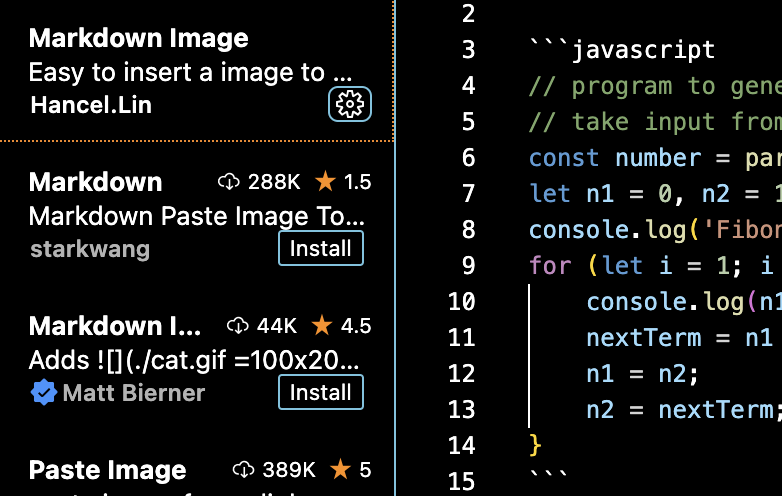

Here is an example of a **JavaScript** code that prints the Fibonacci sequence up to a certain number:

```javascript
// program to generate fibonacci series up to n terms
// take input from the user
const number = parseInt(prompt('Enter the number of terms: '));
let n1 = 0, n2 = 1, nextTerm;
console.log('Fibonacci Series:');
for (let i = 1; i <= number; i++) {
    console.log(n1);
    nextTerm = n1 + n2;
    n1 = n2;
    n2 = nextTerm;
}
```

The above code prompts the user to enter the number of terms they want in the Fibonacci series. It then uses a `for` loop to iterate over the terms and prints the Fibonacci series up to the number entered by the user. The first two terms of the series are 0 and 1, and the next term is defined as the sum of the previous two terms ¹²³.

I hope this helps! Let me know if you have any other questions.


  


